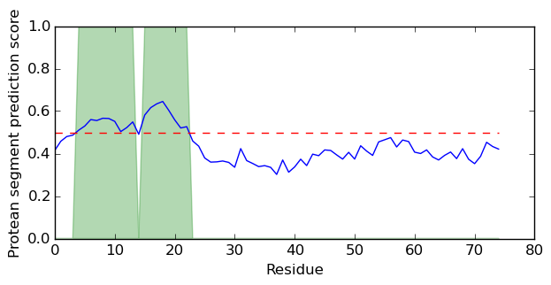

# Proteus

- Requires python and the machine learning package 'scikit-learn'
- A slightly modified version of DISOPRED3.0 is distributed with this package
- 'scikit-learn' may require additional packages to be installed 
- Also requires the uniref90.fasta database and its associated files in the folder DB
- download the updated-most version of 'uniref90.fasta' file (sequence database) from the web (http://www.ebi.ac.uk/uniprot/database/download.html)
- do a format database on it (formatdb) to generate the associated files 
- And empty DB directory is provided with the installation 

## Installation Notes for scikit-learn
This tutorial requires the following packages:

- Python version 2.6-2.7 or 3.3-3.4
- `numpy` version 1.5 or later: http://www.numpy.org/
- `scipy` version 0.10 or later: http://www.scipy.org/
- `matplotlib` version 1.3 or later: http://matplotlib.org/
- `scikit-learn` version 0.17: http://scikit-learn.org
- `seaborn` version 0.5 or later

### Installation of scikit-learn in Ubuntu 14.04

sudo apt-get install python-sklearn  
sudo apt-get update
sudo apt-get install build-essential python-dev python-setuptools python-numpy python-scipy libatlas-dev libatlas3gf-base
pip install --user --install-option="--prefix=" -U scikit-learn

### Installing Proteus

```sh
$ git clone https://github.com/bjornwallner/proteus
$ cd proteus
$ chmod +x proteus/run_proteus.py
```

## The program has just one inputs

        1. A fasta file containing a single amino acid sequence in fasta format

##### Run Step: 
```sh
$ ./proteus/run_proteus.py <basename.fasta>
```

> EXAMPLE OUTPUT: 
```sh 
$ cat basename.seq.proteus

1 M 1 0.518
2 R 1 0.561
3 V 0 0.439
4 K 0 0.416
5 E 0 0.438
6 I 0 0.439
7 R 0 0.392
8 K 0 0.427
9 N 0 0.405
10 Y 0 0.400


```

and a graphical representation (.png) of the same (Protean segment prediction score vs. Residue)




